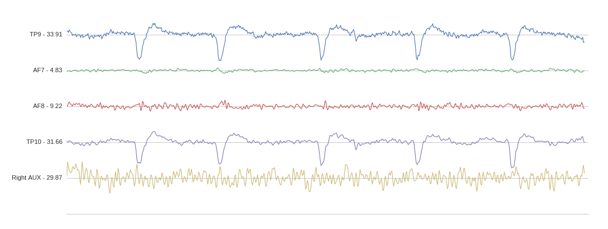

[](https://zenodo.org/badge/latestdoi/80209610)

# Muse LSL

A Python package for streaming, visualizing, and recording EEG data from the Muse devices developed by InteraXon.



## Requirements

The code relies on a number of different bluetooth backends for connecting to the muse. We recommend using the `bleak` backend (enabled by default), but you may be interested in [BlueMuse](https://github.com/kowalej/BlueMuse/tree/master/Dist) for a GUI to discover and connect to Muse devices on Windows or [bgapi] if you are on a Mac with a BLED112 dongle. 

**Compatible with Python 2.7 and Python 3.x**

**Compatible with Muse 2, Muse S, and the classic Muse (2016)**

_Note: if you run into any issues, first check out out [Common Issues](#common-issues) and then the [Issues](https://github.com/alexandrebarachant/muse-lsl/issues) section of this repository_

## Getting Started

### Installation

Install Muse LSL with pip

    pip install muselsl

### Setting Up a Stream

On Windows 10, we recommend using the [BlueMuse](https://github.com/kowalej/BlueMuse/tree/master/Dist) GUI to set up an LSL stream. On Mac and Linux, the easiest way to get Muse data is to use Muse LSL directly from the command line. Use the `-h` flag to get a comprehensive list of all commands and options.

To print a list of available muses:

    $ muselsl list

To begin an LSL stream from the first available Muse:

    $ muselsl stream  

To connect to a specific Muse you can pass the name of the device as an argument. Device names can be found on the inside of the left earpiece (e.g. Muse-41D2):

    $ muselsl stream --name YOUR_DEVICE_NAME

You can also directly pass the MAC address of your Muse. This provides the benefit of bypassing the device discovery step and can make connecting to devices quicker and more reliable:

    $ muselsl stream --address YOUR_DEVICE_ADDRESS

### Working with Streaming Data

Once an LSL stream is created, you have access to the following commands.

*Note: the process running the `stream` command must be kept alive in order to maintain the LSL stream. These following commands should be run in another terminal or second process*

To view data:

    $ muselsl view

If the visualization freezes or is laggy, you can also try the alternate version 2 of the viewer. *Note: this will require the additional [vispy](https://github.com/vispy/vispy) and [mne](https://github.com/mne-tools/mne-python) dependencies*

    $ muselsl view --version 2

To record EEG data into a CSV:

    $ muselsl record --duration 60  

*Note: this command will also save data from any LSL stream containing 'Markers' data, such as from the stimulus presentation scripts in [EEG Notebooks](https://github.com/neurotechx/eeg-notebooks)*

Alternatively, you can record data directly without using LSL through the following command:

    $ muselsl record_direct --duration 60

_Note: direct recording does not allow 'Markers' data to be recorded_

## Running Experiments

Muse LSL was designed so that the Muse could be used to run a number of classic EEG experiments, including the [P300 event-related potential](http://alexandre.barachant.org/blog/2017/02/05/P300-with-muse.html) and the SSVEP and SSAEP evoked potentials.

The code to perform these experiments is still available, but is now maintained in the [EEG Notebooks](https://github.com/neurotechx/eeg-notebooks) repository by the [NeuroTechX](https://neurotechx.com) community.

## Usage as a Library

If you want to integrate Muse LSL into your own Python project, you can import and use its functions as you would any Python library. Examples are available in the `examples` folder:

```Python
from muselsl import stream, list_muses

muses = list_muses()
stream(muses[0]['address'])

# Note: Streaming is synchronous, so code here will not execute until after the stream has been closed
print('Stream has ended')
```

## Alternate Data Types

In addition to EEG, the Muse also provides data from an accelerometer, gyroscope, and, in the case of the Muse 2, a photoplethysmography (PPG) sensor. These data types can be enabled via command line arguments or by passing the correct parameters to the `stream` function. Once enabled, PPG, accelerometer, and gyroscope data will streamed in their own separate LSL streams named "PPG", "ACC", and "GYRO", respectively.

To stream data from all sensors in a Muse 2 from the command line:

    muselsl stream --ppg --acc --gyro

As a library function:

```Python
from muselsl import stream, list_muses

muses = list_muses()
stream(muses[0]['address'], ppg_enabled=True, acc_enabled=True, gyro_enabled=True)
```

To record data from an alternate data source:

    muselsl record --type ACC

*Note: The record process will only record from one data type at a time. However, multiple terminals or processes can be used to record from multiple data types simultaneously*

## What is LSL?

Lab Streaming Layer or LSL is a system designed to unify the collection of time series data for research experiments. It has become standard in the field of EEG-based brain-computer interfaces for its ability to make seperate streams of data available on a network with time synchronization and near real-time access. For more information, check out this [lecture from Modern Brain-Computer Interface Design](https://www.youtube.com/watch?v=Y1at7yrcFW0) or the [LSL repository](https://github.com/sccn/labstreaminglayer)

## Common Issues

### Mac and Windows

1.  Connection issues with BLED112 dongle:

- You may need to use the `--interface` argument to provide the appropriate COM port value for the BLED112 device. The default value is COM9. To setup or view the device's COM port go to your OS's system settings

### Linux

1.  `pygatt.exceptions.BLEError: Unexpected error when scanning: Set scan parameters failed: Operation not permitted` (Linux)

- This is an issue with pygatt requiring root privileges to run a scan. Make sure you [have `libcap` installed](https://askubuntu.com/questions/347788/how-can-i-install-libpcap-header-files-on-ubuntu-12-04) and run `` sudo setcap 'cap_net_raw,cap_net_admin+eip' `which hcitool` ``

2.  `pygatt.exceptions.BLEError: No characteristic found matching 273e0003-4c4d-454d-96be-f03bac821358` (Linux)

- There is a problem with the most recent version of pygatt. Work around this by downgrading to 3.1.1: `pip install pygatt==3.1.1`

3.  `pygatt.exceptions.BLEError: No BLE adapter found` (Linux)

- Make sure your computer's Bluetooth is turned on.

4.  `pygatt.exceptions.BLEError: Unexpected error when scanning: Set scan parameters failed: Connection timed out` (Linux)

- This seems to be due to a OS-level Bluetooth crash. Try turning your computer's bluetooth off and on again

5.  `'RuntimeError: could not create stream outlet'` (Linux)

- This appears to be due to Linux-specific issues with the newest version of pylsl. Ensure that you have pylsl 1.10.5 installed in the environment in which you are trying to run Muse LSL
- If this is preceded by `Could not instantiate IPv4 stack: getrandom`, it could be [this issue](https://github.com/boostorg/uuid/issues/91) which can be resolved by building `liblsl` with `-DBOOST_UUID_RANDOM_PROVIDER_FORCE_POSIX` (e.g. by editing `standalone_compilation_linux.sh`)

## Citing muse-lsl

```
@misc{muse-lsl,
  author       = {Alexandre Barachant and
                  Dano Morrison and
                  Hubert Banville and
                  Jason Kowaleski and
                  Uri Shaked and
                  Sylvain Chevallier and
                  Juan Jesús Torre Tresols},
  title        = {muse-lsl},
  month        = may,
  year         = 2019,
  doi          = {10.5281/zenodo.3228861},
  url          = {https://doi.org/10.5281/zenodo.3228861}
}
```

> Alexandre Barachant, Dano Morrison, Hubert Banville, Jason Kowaleski, Uri Shaked, Sylvain Chevallier, & Juan Jesús Torre Tresols. (2019, May 25). muse-lsl (Version v2.0.2). Zenodo. http://doi.org/10.5281/zenodo.3228861
